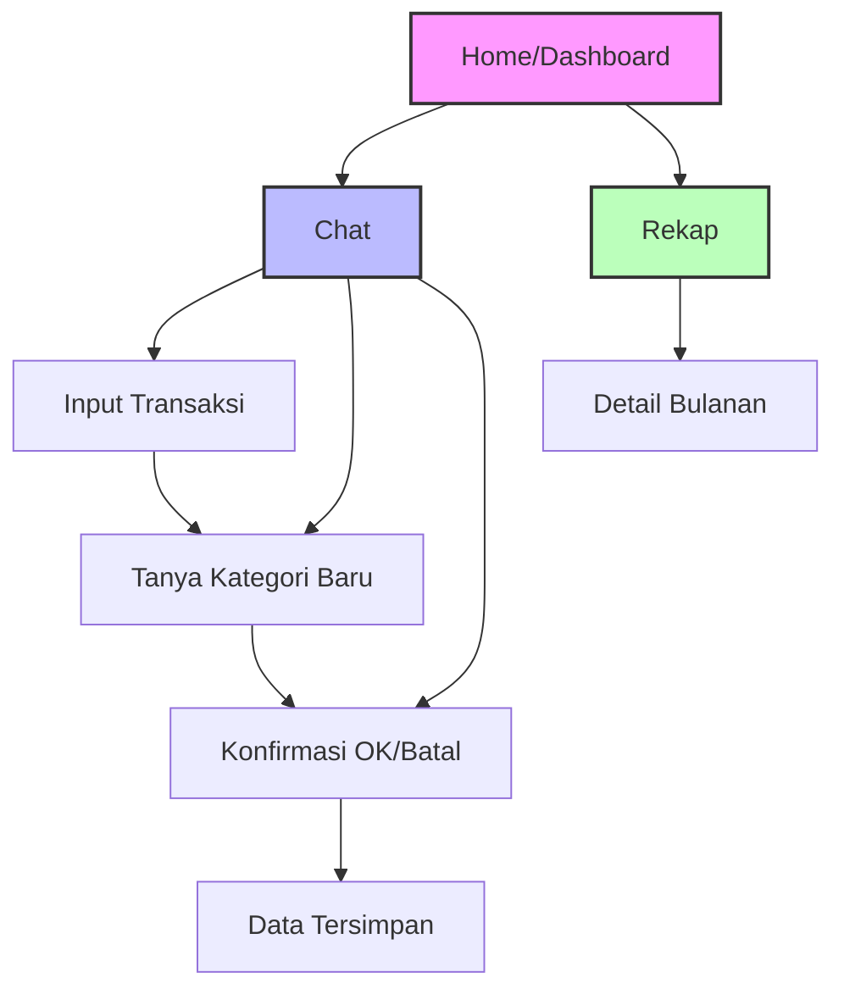

## 1. Product Overview
Aplikasi keuangan pribadi berbasis chat yang ringan dan mobile-friendly, menggunakan Google Apps Script dan Google Spreadsheet. Memungkinkan user mencatat transaksi melalui chat natural, melihat dashboard ringkas, dan rekap bulanan.

Target user: individu yang ingin mencatat keuangan pribadi dengan cara sederhana melalui chat, tidak perlu form kompleks, fokus pada kecepatan dan kemudahan penggunaan di HP.

## 2. Core Features

### 2.1 User Roles
| Role | Registration Method | Core Permissions |
|------|---------------------|------------------|
| Personal User | Google Account (Google Apps Script) | Full access to all financial features |

### 2.2 Feature Module
Aplikasi ini terdiri dari 3 halaman utama:
1. **Dashboard**: Ringkasan keuangan bulan aktif, saldo rekening, 3 kategori pengeluaran terbesar, warning keuangan, tagihan terdekat
2. **Chat**: Fitur utama untuk input transaksi, pertanyaan keuangan, dan interaksi natural dengan bot
3. **Rekap**: List bulanan dengan total pemasukan, pengeluaran, dan sisa uang per bulan

### 2.3 Page Details
| Page Name | Module Name | Feature description |
|-----------|-------------|---------------------|
| Dashboard | Summary Cards | Tampilkan total pemasukan bulan aktif, total pengeluaran bulan aktif, sisa uang bulan aktif, total saldo semua rekening/e-wallet |
| Dashboard | Top Categories | Tampilkan 3 kategori pengeluaran terbesar bulan aktif |
| Dashboard | Warnings | Tampilkan warning singkat keuangan: over budget, saldo rendah, tagihan mendekati jatuh tempo |
| Dashboard | Upcoming Bills | Tampilkan tagihan terdekat yang belum dibayar |
| Chat | Chat Interface | Area chat dengan history percakapan, input text, dan quick reply buttons |
| Chat | Quick Replies | Tombol cepat untuk OK dan batal saat konfirmasi data |
| Chat | Transaction Parser | Parsing input natural: ekstraksi nominal, tanggal, kategori, jenis transaksi |
| Chat | Category Learning | Sistem belajar kategori baru dari user input dengan 2 tahap pertanyaan |
| Chat | Confirmation Flow | Tampilkan ringkasan hasil parsing sebelum menyimpan, dengan pilihan OK/batal |
| Chat | State Management | Simpan state percakapan: pending transactions, pending categories, pending confirmation |
| Rekap | Monthly List | Tampilkan list bulanan dengan nama bulan, total pemasukan, total pengeluaran, sisa uang |
| Rekap | Navigation | Scroll vertical untuk melihat bulan-bulan sebelumnya |

## 3. Core Process

### User Flow - Input Transaksi Baru:
1. User membuka tab Chat dan mengetik transaksi: "beli ayam 5k"
2. Sistem parsing chat dan menampilkan ringkasan: "Jenis: Pengeluaran, Kategori: Makan, Deskripsi: Ayam, Nominal: Rp5.000, Tanggal: Hari ini"
3. User melihat quick reply OK/Batal di bawah chat
4. User memilih OK untuk menyimpan atau Batal untuk membatalkan
5. Jika OK, data disimpan ke spreadsheet dan cache diupdate

### User Flow - Kategori Baru:
1. User input: "apel 10k"
2. Keyword "apel" tidak ditemukan di kamus
3. Bot bertanya: "Kategori untuk 'apel' belum ditemukan. Ini termasuk kategori apa?"
4. User memilih "Makanan & Minuman"
5. Bot bertanya: "Termasuk subkategori apa?"
6. User memilih "Buah"
7. Sistem menyimpan keyword baru ke spreadsheet dan update cache
8. Lanjut ke flow konfirmasi transaksi

### User Flow - Dashboard:
1. User membuka tab Dashboard
2. Sistem load data dari cache JSON untuk performa cepat
3. Tampilkan ringkasan bulan aktif secara real-time
4. User dapat melihat warning dan tagihan dengan sekali scroll

### User Flow - Rekap:
1. User membuka tab Rekap
2. Sistem load rekap bulanan dari cache
3. User scroll untuk melihat bulan-bulan sebelumnya

## 4. User Interface Design

### 4.1 Design Style
- **Primary Color**: Hijau tosca (#20B2AA) untuk elemen utama
- **Secondary Color**: Abu-abu muda (#F5F5F5) untuk background
- **Button Style**: Rounded corner, shadow halus, warna kontras
- **Font**: System font (Roboto/SF Pro) untuk keterbacaan optimal
- **Font Sizes**: 14px body text, 16px headers, 12px caption
- **Layout Style**: Card-based dengan bottom navigation tetap
- **Icons**: Material Icons untuk konsistensi dan kejelasan

### 4.2 Page Design Overview
| Page Name | Module Name | UI Elements |
|-----------|-------------|-------------|
| Dashboard | Summary Cards | Card putih dengan rounded corners, shadow 2dp, icon kecil di kiri judul, angka besar bold untuk nominal |
| Dashboard | Top Categories | Horizontal bar chart sederhana, warna gradasi hijau ke merah untuk besar kecilnya pengeluaran |
| Dashboard | Warnings | Card kuning/oranye dengan icon warning, teks warning maksimal 2 baris |
| Dashboard | Upcoming Bills | List kecil dengan tanggal dan nama tagihan, warna merah untuk yang melewati jatuh tempo |
| Chat | Chat Bubble | User bubble hijau muda di kanan, bot bubble putih di kiri, timestamp kecil di bawah |
| Chat | Input Area | Text field di bawah dengan send button, tinggi minimum untuk 2 baris teks |
| Chat | Quick Replies | 2 tombol horizontal (OK/Batal) muncul di bawah chat bot, warna hijau/merah |
| Rekap | Month Card | Card putih dengan header bulan, 3 kolom angka (masuk/keluar/sisa), warna hijau/merah/hitam |

### 4.3 Responsiveness
Mobile-first design dengan breakpoint:
- Mobile: < 768px (default)
- Tablet: 768px - 1024px
- Desktop: > 1024px

Bottom navigation tetap di bawah untuk mobile, sidebar untuk desktop. Touch target minimum 48px untuk semua tombol interaktif.