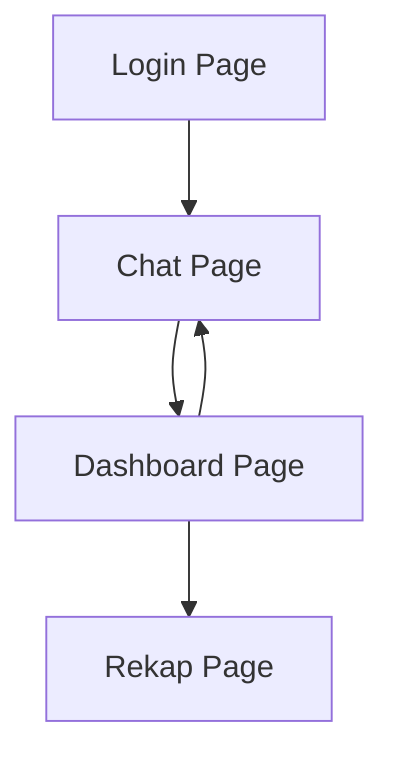

## 1. Product Overview
Aplikasi Keuangan Pribadi berbasis Laravel dengan antarmuka chat untuk mencatat transaksi harian. Membantu pengguna mengelola keuangan secara efisien melalui parsing NLP otomatis dan dashboard yang intuitif.

Target pengguna: individu yang ingin mengelola keuangan pribadi dengan cara yang modern dan mudah digunakan, khususnya pengguna mobile.

## 2. Core Features

### 2.1 User Roles
| Role | Registration Method | Core Permissions |
|------|---------------------|------------------|
| User | Email registration | Full access to personal finance features, chat input, dashboard, rekap laporan |

### 2.2 Feature Module
Aplikasi ini terdiri dari halaman-halaman utama berikut:
1. **Login Page**: Form login, registrasi, lupa password
2. **Chat Page**: Input chat NLP, history transaksi, parsing otomatis
3. **Dashboard Page**: 3 menu utama (Ringkasan, Transaksi, Rekap)
4. **Rekap Page**: Laporan keuangan, filter tanggal, export data

### 2.3 Page Details
| Page Name | Module Name | Feature description |
|-----------|-------------|---------------------|
| Login Page | Authentication | Login dengan email/password, registrasi akun baru, reset password |
| Chat Page | Chat Interface | Input teks untuk transaksi, parsing NLP otomatis, tampilan history transaksi |
| Dashboard Page | Ringkasan | Menampilkan total pemasukan, pengeluaran, dan saldo saat ini |
| Dashboard Page | Transaksi | Daftar transaksi terbaru dengan filter dan pencarian |
| Dashboard Page | Rekap | Grafik dan statistik keuangan periode tertentu |
| Rekap Page | Laporan | Generate laporan bulanan/tahunan, export ke PDF/Excel |
| Rekap Page | Filter | Filter berdasarkan tanggal, kategori, dan jenis transaksi |

## 3. Core Process
**User Flow:**
1. User melakukan registrasi/login ke aplikasi
2. User masuk ke halaman chat untuk mencatat transaksi
3. User mengetik transaksi dalam bahasa natural (contoh: "Makan siang di warung 25 ribu")
4. Sistem parsing NLP mengubah teks menjadi data transaksi
5. User dapat melihat dashboard dengan ringkasan keuangan
6. User dapat melihat rekap laporan dan export data

## 4. User Interface Design

### 4.1 Design Style
- **Primary Color**: Biru tua (#1e40af) untuk header dan tombol utama
- **Secondary Color**: Hijau (#10b981) untuk pemasukan, Merah (#ef4444) untuk pengeluaran
- **Button Style**: Rounded dengan shadow subtle
- **Font**: Inter untuk heading, system font untuk body
- **Layout**: Mobile-first dengan card-based design
- **Icons**: Heroicons untuk konsistensi

### 4.2 Page Design Overview
| Page Name | Module Name | UI Elements |
|-----------|-------------|-------------|
| Chat Page | Input Area | Textarea di bagian bawah dengan tombol kirim, bubble chat mirip WhatsApp |
| Dashboard Page | Ringkasan | Card besar dengan angka besar untuk total, warna hijau/merah sesuai jenis |
| Dashboard Page | Transaksi | List card dengan icon kategori, nama, tanggal, dan jumlah |
| Rekap Page | Grafik | Chart.js untuk visualisasi data, filter di bagian atas |

### 4.3 Responsiveness
Mobile-first design dengan breakpoint:
- Mobile: < 640px (single column)
- Tablet: 640px - 1024px (adjustable grid)
- Desktop: > 1024px (multi-column layout)

Touch interaction dioptimalkan untuk mobile dengan swipe gesture untuk menghapus transaksi.