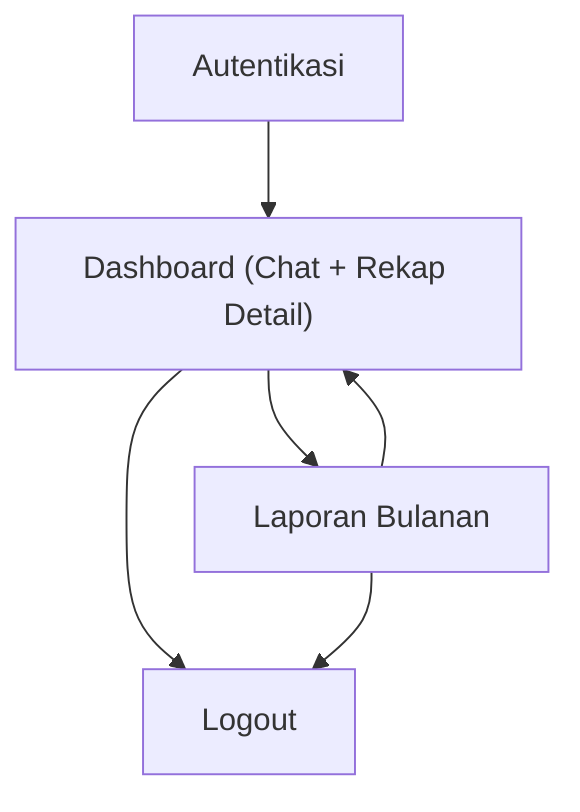

## 1. Product Overview
Refactor aplikasi finance berbasis Laravel menjadi UI modern dengan React (via Inertia) + Tailwind, tanpa memindahkan backend inti.
Fokus: auth per-account, chat UI untuk interaksi/penelusuran data, rekap detail transaksi, serta export + email laporan bulanan Excel debit/kredit.

## 2. Core Features

### 2.1 User Roles
| Role | Registration Method | Core Permissions |
|------|---------------------|------------------|
| Pengguna | Daftar via email + password | Kelola akun (account) miliknya, transaksi, chat, rekap, export & email laporan |

### 2.2 Feature Module
Aplikasi ini terdiri dari halaman inti berikut:
1. **Autentikasi**: login, registrasi, lupa password, pilih/kelola account aktif.
2. **Dashboard (Chat + Rekap Detail)**: chat UI, ringkasan & rekap detail, daftar transaksi debit/kredit.
3. **Laporan Bulanan**: pilih periode & account, preview rekap debit/kredit, export Excel, kirim email laporan.

### 2.3 Page Details
| Page Name | Module Name | Feature description |
|---|---|---|
| Autentikasi | Login/Registrasi | Memverifikasi pengguna (email+password), membuat akun pengguna baru, menjaga sesi login. |
| Autentikasi | Reset Password | Mengirim tautan reset password dan mengubah password pengguna. |
| Autentikasi | Manajemen Account | Membuat/mengubah/menghapus account milik pengguna, memilih account aktif untuk konteks data. |
| Dashboard (Chat + Rekap Detail) | Header & Account Switcher | Menampilkan navigasi utama, profil, logout, serta pemilih account aktif. |
| Dashboard (Chat + Rekap Detail) | Chat UI | Menampilkan riwayat chat per account, mengirim pesan baru, menandai konteks (mis. periode/keyword) agar chat terkait data yang sedang dilihat. |
| Dashboard (Chat + Rekap Detail) | Rekap Ringkas | Menampilkan total debit, total kredit, dan saldo (berdasarkan periode terpilih). |
| Dashboard (Chat + Rekap Detail) | Rekap Detail | Menampilkan tabel transaksi (tanggal, deskripsi, kategori bila ada, debit/kredit), pencarian, sortir, filter periode, dan pagination. |
| Laporan Bulanan | Pemilihan Periode & Account | Memilih bulan/tahun serta account target, memvalidasi input, dan memuat data ringkasan. |
| Laporan Bulanan | Preview Laporan | Menampilkan ringkasan debit/kredit per bulan, serta highlight anomali sederhana (mis. nilai terbesar) bila sudah ada di sistem saat ini. |
| Laporan Bulanan | Export Excel | Menghasilkan file Excel laporan bulanan debit/kredit untuk diunduh. |
| Laporan Bulanan | Email Laporan | Mengirim laporan Excel ke email pengguna (atau email tujuan yang diizinkan), menampilkan status berhasil/gagal. |

## 3. Core Process
**Flow Pengguna**
1) Pengguna registrasi atau login.
2) Pengguna membuat atau memilih account aktif.
3) Di Dashboard, pengguna melihat rekap ringkas dan rekap detail transaksi pada periode tertentu.
4) Pengguna memakai Chat untuk bertanya/menelusuri data pada konteks account & periode yang sama.
5) Pengguna membuka Laporan Bulanan, memilih bulan dan account.
6) Pengguna preview laporan, lalu export Excel dan/atau kirim laporan via email.

