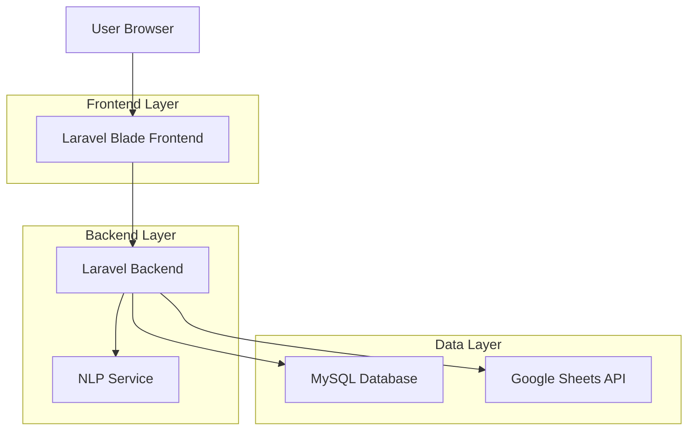
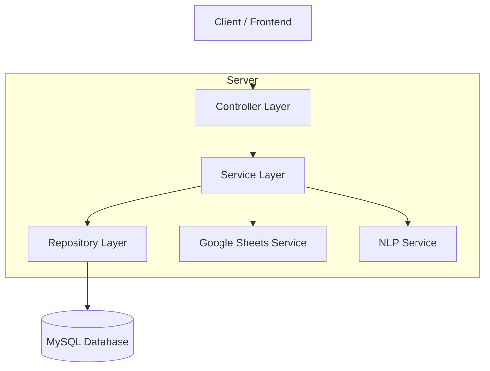
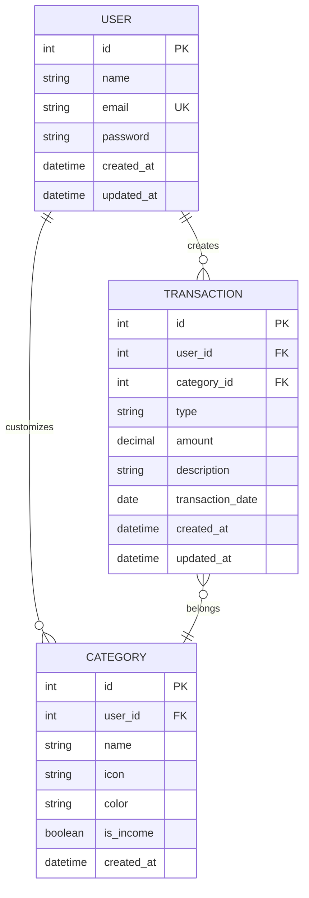

## 1. Architecture design



## 2. Technology Description
- **Frontend**: Laravel Blade + Tailwind CSS + Vue.js (optional)
- **Backend**: Laravel 10.x
- **Database**: MySQL 8.0
- **Authentication**: Laravel Breeze/Fortify
- **NLP Parsing**: Custom PHP service atau Google Cloud Natural Language API
- **Export**: Laravel Excel (PHPSpreadsheet)
- **Charts**: Chart.js

## 3. Route definitions
| Route | Purpose |
|-------|---------|
| /login | Halaman login user |
| /register | Halaman registrasi akun baru |
| /dashboard | Dashboard utama dengan 3 menu (Ringkasan, Transaksi, Rekap) |
| /chat | Halaman chat untuk input transaksi |
| /transactions | Daftar semua transaksi |
| /reports | Halaman rekap dan laporan |
| /profile | Pengaturan profil user |
| /api/transactions | API untuk CRUD transaksi |
| /api/parse-transaction | API untuk parsing NLP transaksi |

## 4. API definitions

### 4.1 Authentication API
```
POST /api/auth/login
```

Request:
| Param Name| Param Type  | isRequired  | Description |
|-----------|-------------|-------------|-------------|
| email     | string      | true        | Email user |
| password  | string      | true        | Password user |

Response:
```json
{
  "token": "string",
  "user": {
    "id": "uuid",
    "name": "string",
    "email": "string"
  }
}
```

### 4.2 Transaction Parsing API
```
POST /api/parse-transaction
```

Request:
| Param Name| Param Type  | isRequired  | Description |
|-----------|-------------|-------------|-------------|
| text      | string      | true        | Teks transaksi untuk diparsing |

Response:
```json
{
  "type": "income|expense",
  "amount": 25000,
  "category": "food",
  "description": "Makan siang di warung",
  "date": "2024-01-01"
}
```

## 5. Server architecture diagram



## 6. Data model

### 6.1 Data model definition


### 6.2 Data Definition Language

**Users Table**
```sql
CREATE TABLE users (
    id BIGINT UNSIGNED PRIMARY KEY AUTO_INCREMENT,
    name VARCHAR(255) NOT NULL,
    email VARCHAR(255) UNIQUE NOT NULL,
    email_verified_at TIMESTAMP NULL,
    password VARCHAR(255) NOT NULL,
    remember_token VARCHAR(100) NULL,
    created_at TIMESTAMP DEFAULT CURRENT_TIMESTAMP,
    updated_at TIMESTAMP DEFAULT CURRENT_TIMESTAMP ON UPDATE CURRENT_TIMESTAMP
);
```

**Categories Table**
```sql
CREATE TABLE categories (
    id BIGINT UNSIGNED PRIMARY KEY AUTO_INCREMENT,
    user_id BIGINT UNSIGNED NULL,
    name VARCHAR(100) NOT NULL,
    icon VARCHAR(50) DEFAULT 'cash',
    color VARCHAR(7) DEFAULT '#3b82f6',
    is_income BOOLEAN DEFAULT FALSE,
    created_at TIMESTAMP DEFAULT CURRENT_TIMESTAMP,
    FOREIGN KEY (user_id) REFERENCES users(id) ON DELETE CASCADE
);
```

**Transactions Table**
```sql
CREATE TABLE transactions (
    id BIGINT UNSIGNED PRIMARY KEY AUTO_INCREMENT,
    user_id BIGINT UNSIGNED NOT NULL,
    category_id BIGINT UNSIGNED NULL,
    type ENUM('income', 'expense') NOT NULL,
    amount DECIMAL(15,2) NOT NULL,
    description TEXT,
    transaction_date DATE NOT NULL,
    created_at TIMESTAMP DEFAULT CURRENT_TIMESTAMP,
    updated_at TIMESTAMP DEFAULT CURRENT_TIMESTAMP ON UPDATE CURRENT_TIMESTAMP,
    FOREIGN KEY (user_id) REFERENCES users(id) ON DELETE CASCADE,
    FOREIGN KEY (category_id) REFERENCES categories(id) ON DELETE SET NULL
);

-- Indexes for performance
CREATE INDEX idx_transactions_user_id ON transactions(user_id);
CREATE INDEX idx_transactions_date ON transactions(transaction_date);
CREATE INDEX idx_transactions_type ON transactions(type);
```

**Default Categories**
```sql
INSERT INTO categories (name, icon, color, is_income) VALUES
('Gaji', 'briefcase', '#10b981', TRUE),
('Bonus', 'gift', '#22c55e', TRUE),
('Investasi', 'chart-line', '#16a34a', TRUE),
('Makanan', 'utensils', '#ef4444', FALSE),
('Transportasi', 'car', '#f59e0b', FALSE),
('Hiburan', 'gamepad', '#8b5cf6', FALSE),
('Belanja', 'shopping-bag', '#f97316', FALSE),
('Tagihan', 'file-invoice', '#dc2626', FALSE);
```