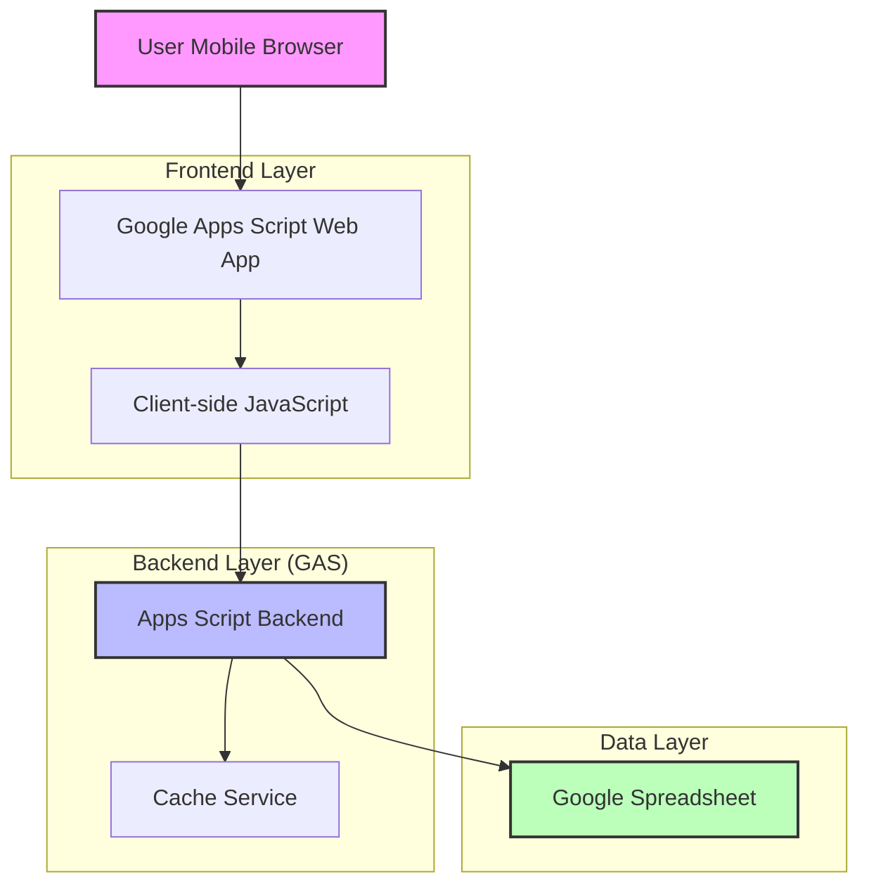
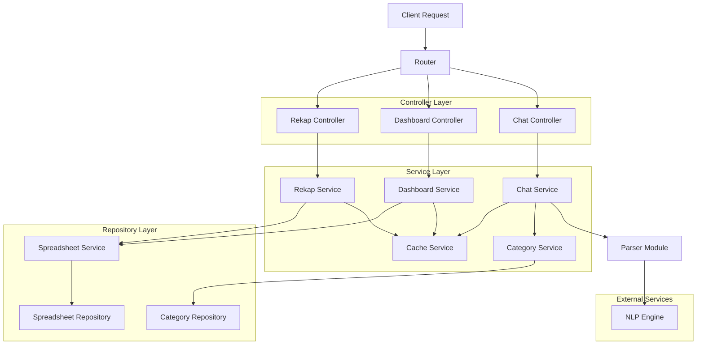
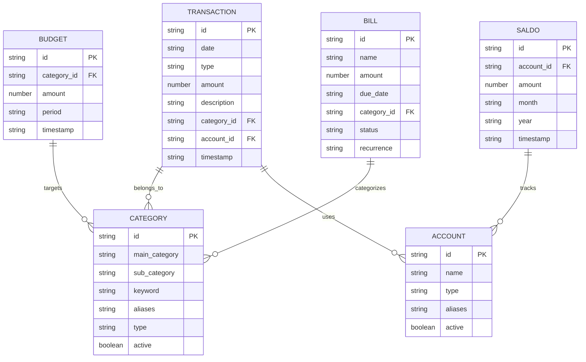

## 1. Architecture Design



## 2. Technology Description

- **Frontend**: HTML5 + CSS3 + Vanilla JavaScript (mobile-first)
- **Backend**: Google Apps Script (GAS)
- **Database**: Google Spreadsheet (9 sheets)
- **Cache**: Google Apps Script Cache Service + Properties Service
- **Deployment**: Google Apps Script Web App

## 3. Route Definitions

| Route | Purpose |
|-------|---------|
| / (root) | Main web app dengan 3 tab: Dashboard, Chat, Rekap |
| /doGet | Apps Script function untuk serve HTML interface |
| /processChat | Apps Script function untuk process chat input |
| /getDashboard | Apps Script function untuk get dashboard data |
| /getRekap | Apps Script function untuk get monthly recap |
| /confirmTransaction | Apps Script function untuk confirm/save transaction |
| /cancelTransaction | Apps Script function untuk cancel pending transaction |

## 4. API Definitions

### 4.1 Core API Endpoints

**Process Chat**
```
POST /processChat
```

Request:
| Param Name | Param Type | isRequired | Description |
|------------|-------------|-------------|-------------|
| message | string | true | User chat message |
| sessionId | string | true | Unique session identifier |

Response:
```json
{
  "type": "transaction|question|info",
  "message": "Bot response message",
  "quickReplies": ["OK", "batal"],
  "pendingData": {
    "type": "transaction",
    "amount": 5000,
    "category": "Makan",
    "description": "Ayam",
    "date": "2026-04-01"
  }
}
```

**Confirm Transaction**
```
POST /confirmTransaction
```

Request:
| Param Name | Param Type | isRequired | Description |
|------------|-------------|-------------|-------------|
| sessionId | string | true | Session identifier |
| pendingId | string | true | Pending transaction ID |

**Get Dashboard Data**
```
GET /getDashboard
```

Response:
```json
{
  "currentMonth": {
    "income": 5000000,
    "expense": 3500000,
    "balance": 1500000,
    "totalAccounts": 2500000
  },
  "topCategories": [
    {"name": "Makan", "amount": 1200000},
    {"name": "Transport", "amount": 800000},
    {"name": "Belanja", "amount": 600000}
  ],
  "warnings": [
    "Pengeluaran makan melebihi budget 20%"
  ],
  "upcomingBills": [
    {"name": "Listrik", "dueDate": "2026-04-05", "amount": 300000}
  ]
}
```

## 5. Server Architecture Diagram



## 6. Data Model

### 6.1 Data Model Definition



### 6.2 Spreadsheet Structure

**TRANSACTION Sheet**
```
Headers: ID | DATE | TYPE | AMOUNT | DESCRIPTION | CATEGORY | ACCOUNT | TIMESTAMP
```

**KATEGORI Sheet**
```
Headers: ID | KATEGORI_UTAMA | SUB_KATEGORI | KEYWORD | ALIAS | JENIS | AKTIF
```

**REKENING Sheet**
```
Headers: ID | NAMA | TIPE | ALIAS | AKTIF
```

**SALDO_BULANAN Sheet**
```
Headers: ID | REKENING_ID | BULAN | TAHUN | SALDO | TIMESTAMP
```

**TAGIHAN Sheet**
```
Headers: ID | NAMA | NOMINAL | TANGGAL_JATUH_TEMPO | KATEGORI | STATUS | RECURRENCE
```

**BUDGET Sheet**
```
Headers: ID | KATEGORI_ID | NOMINAL | PERIODE | TIMESTAMP
```

**KAMUS Sheet**
```
Headers: KATA | TIPE | ALIAS | KATEGORI | FREKUENSI
```

**LOG_CHAT Sheet**
```
Headers: ID | TIMESTAMP | USER_MESSAGE | BOT_RESPONSE | INTENT | ENTITIES | STATUS
```

**REKAP_BULANAN Sheet**
```
Headers: BULAN | TAHUN | TOTAL_PEMASUKAN | TOTAL_PENGELUARAN | SISA_UANG | TIMESTAMP
```

## 7. Cache Strategy

### 7.1 Cache Types
- **Dictionary Cache**: Kategori, subkategori, keyword, alias
- **Dashboard Cache**: Summary bulan aktif, saldo, warning
- **Monthly Cache**: Rekap bulanan untuk performa cepat
- **Bill Cache**: Tagihan aktif dan jatuh tempo

### 7.2 Cache Implementation
```javascript
// Cache Service wrapper
class CacheManager {
  constructor() {
    this.cache = CacheService.getScriptCache();
    this.properties = PropertiesService.getScriptProperties();
  }
  
  get(key) {
    return this.cache.get(key);
  }
  
  put(key, value, expirationInSeconds = 3600) {
    this.cache.put(key, value, expirationInSeconds);
  }
  
  getDictionary() {
    const cached = this.get('dictionary');
    if (cached) return JSON.parse(cached);
    
    // Load from spreadsheet if not cached
    const dictionary = this.loadDictionaryFromSheet();
    this.put('dictionary', JSON.stringify(dictionary), 3600);
    return dictionary;
  }
}
```

## 8. NLP Parsing Architecture

### 8.1 Intent Detection
```javascript
const INTENTS = {
  TRANSACTION: ['beli', 'bayar', 'jajan', 'makan', 'bensin', 'gaji', 'masuk', 'dapet'],
  BALANCE: ['saldo', 'uang', 'dompet', 'rekening'],
  REPORT: ['rekap', 'ringkasan', 'total', 'berapa'],
  HELP: ['bantuan', 'help', 'cara', 'panduan'],
  BILL: ['tagihan', 'cicilan', 'hutang']
};
```

### 8.2 Entity Extraction
```javascript
const ENTITIES = {
  AMOUNT: /\b(\d+\.?\d*)(k|rb|ribu|jt|juta|rbu)?\b/gi,
  DATE: /\b(hari ini|kemarin|besok|tadi|\d{1,2}[\/\-]\d{1,2}|[a-z]+ \d{1,2}|\d{1,2} [a-z]+)\b/gi,
  CATEGORY: {}, // Loaded from dictionary
  ACCOUNT: {}  // Loaded from dictionary
};
```

### 8.3 Fuzzy Matching
```javascript
function fuzzyMatch(word, dictionary, threshold = 0.8) {
  let bestMatch = null;
  let bestScore = 0;
  
  for (const key in dictionary) {
    const score = similarity(word.toLowerCase(), key.toLowerCase());
    if (score > bestScore && score >= threshold) {
      bestScore = score;
      bestMatch = key;
    }
  }
  
  return bestMatch;
}

function similarity(s1, s2) {
  // Levenshtein distance implementation
  // Returns similarity score 0-1
}
```

## 9. File Structure (Google Apps Script)

```
📁 Code.gs (Main entry point)
📁 app/
  📁 controllers/
    📄 ChatController.gs
    📄 DashboardController.gs
    📄 RecapController.gs
  📁 services/
    📄 ChatService.gs
    📄 ParserService.gs
    📄 CategoryService.gs
    📄 CacheService.gs
    📄 SpreadsheetService.gs
  📁 models/
    📄 Transaction.gs
    📄 Category.gs
    📄 Account.gs
  📁 utils/
    📄 NLPUtils.gs
    📄 DateUtils.gs
    📄 NumberUtils.gs
    📄 ValidationUtils.gs
📁 html/
  📄 index.html (Main UI)
  📄 css.html (Embedded CSS)
  📄 javascript.html (Client-side JS)
📁 config/
  📄 Dictionary.gs (Built-in dictionary)
  📄 Constants.gs (App constants)
```