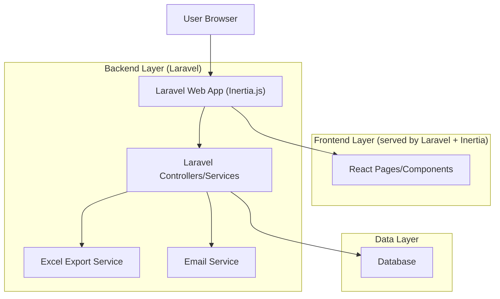
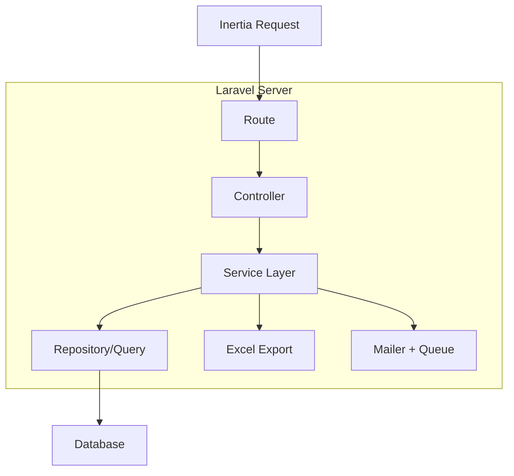
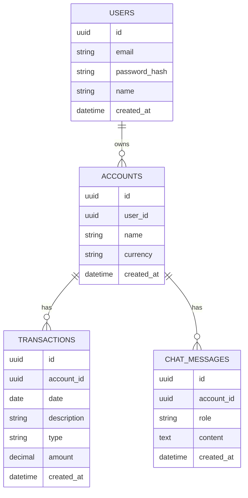

## 1.Architecture design


## 2.Technology Description
- Frontend: React@18 (via Inertia.js) + Tailwind CSS@3
- Backend: Laravel@11 (existing app) + Inertia.js (server adapter) + Laravel Auth (session-based)
- Database: Existing DB (MySQL/PostgreSQL sesuai proyek saat ini)
- Export Excel: maatwebsite/excel (Laravel Excel)
- Email: Laravel Mail (SMTP/SES sesuai konfigurasi) + Queue (untuk proses kirim async)

## 3.Route definitions
| Route | Purpose |
|---|---|
| /login | Halaman login pengguna |
| /register | Halaman registrasi pengguna |
| /forgot-password | Meminta link reset password |
| /reset-password/{token} | Form reset password |
| /accounts | Kelola account milik pengguna (buat/ubah/hapus/pilih aktif) |
| /dashboard | Dashboard: chat UI + rekap ringkas + rekap detail |
| /reports/monthly | Halaman laporan bulanan (preview, export, email) |
| POST /reports/monthly/export | Generate & unduh Excel laporan bulanan debit/kredit |
| POST /reports/monthly/email | Generate & kirim Excel laporan bulanan via email |

## 4.API definitions (If it includes backend services)
### 4.1 Shared TypeScript types (Frontend)
```ts
export type UUID = string;

export type Account = {
  id: UUID;
  name: string;
  currency: string; // mis. "IDR"
  created_at: string;
};

export type Transaction = {
  id: UUID;
  account_id: UUID;
  date: string; // ISO
  description: string;
  type: "debit" | "kredit";
  amount: number;
  created_at: string;
};

export type MonthlySummary = {
  account_id: UUID;
  month: string; // "YYYY-MM"
  total_debit: number;
  total_kredit: number;
  saldo: number;
};

export type ChatMessage = {
  id: UUID;
  account_id: UUID;
  role: "user" | "system";
  content: string;
  created_at: string;
};
```

### 4.2 Monthly report endpoints
POST /reports/monthly/export

Request:
| Param Name | Param Type | isRequired | Description |
|---|---:|---:|---|
| accountId | string(UUID) | true | Account target |
| month | string | true | Bulan laporan format YYYY-MM |

Response:
| Param Name | Param Type | Description |
|---|---|---|
| file | binary | File Excel untuk diunduh |

POST /reports/monthly/email

Request:
| Param Name | Param Type | isRequired | Description |
|---|---:|---:|---|
| accountId | string(UUID) | true | Account target |
| month | string | true | Bulan laporan format YYYY-MM |
| emailTo | string | false | Default ke email akun pengguna bila kosong |

Response:
| Param Name | Param Type | Description |
|---|---|---|
| status | "queued" | Proses email dijalankan via queue |

## 5.Server architecture diagram (If it includes backend services)


## 6.Data model(if applicable)
### 6.1 Data model definition


### 6.2 Data Definition Language
Users (users)
```sql
CREATE TABLE users (
  id CHAR(36) PRIMARY KEY,
  name VARCHAR(100) NOT NULL,
  email VARCHAR(255) NOT NULL UNIQUE,
  password VARCHAR(255) NOT NULL,
  created_at TIMESTAMP NULL,
  updated_at TIMESTAMP NULL
);
```

Accounts (accounts)
```sql
CREATE TABLE accounts (
  id CHAR(36) PRIMARY KEY,
  user_id CHAR(36) NOT NULL,
  name VARCHAR(120) NOT NULL,
  currency VARCHAR(10) NOT NULL DEFAULT 'IDR',
  created_at TIMESTAMP NULL,
  updated_at TIMESTAMP NULL
);

CREATE INDEX idx_accounts_user_id ON accounts(user_id);
```

Transactions (transactions)
```sql
CREATE TABLE transactions (
  id CHAR(36) PRIMARY KEY,
  account_id CHAR(36) NOT NULL,
  date DATE NOT NULL,
  description VARCHAR(255) NOT NULL,
  type VARCHAR(10) NOT NULL, -- 'debit' | 'kredit'
  amount DECIMAL(18,2) NOT NULL,
  created_at TIMESTAMP NULL,
  updated_at TIMESTAMP NULL
);

CREATE INDEX idx_transactions_account_id_date ON transactions(account_id, date);
CREATE INDEX idx_transactions_type ON transactions(type);
```

Chat messages (chat_messages)
```sql
CREATE TABLE chat_messages (
  id CHAR(36) PRIMARY KEY,
  account_id CHAR(36) NOT NULL,
  role VARCHAR(20) NOT NULL, -- 'user' | 'system'
  content TEXT NOT NULL,
  created_at TIMESTAMP NULL,
  updated_at TIMESTAMP NULL
);

CREATE INDEX idx_chat_messages_account_id_created_at ON chat_messages(account_id, created_at);
```